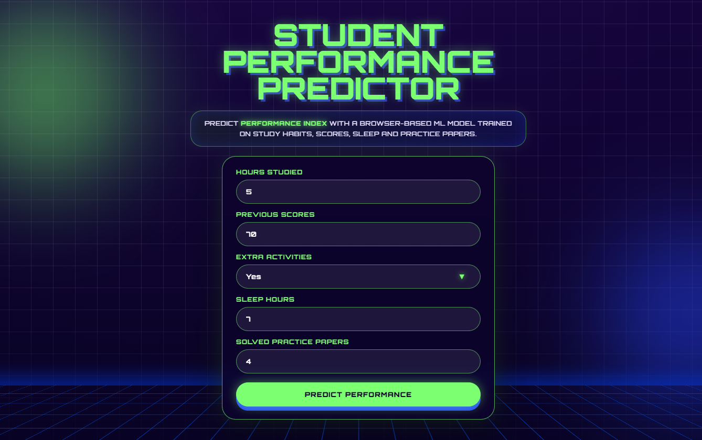
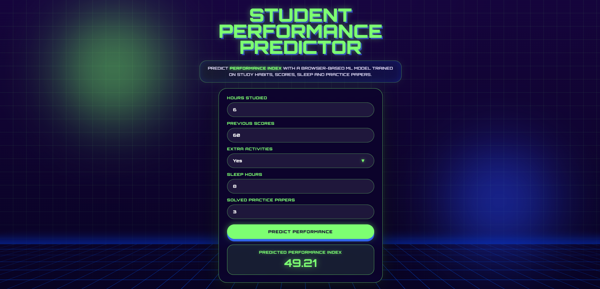

# Student Performance Predictor

Aplikacja webowa przewidująca `Performance Index` ucznia na podstawie jego nawyków nauki, poprzednich wyników, liczby godzin snu, aktywności dodatkowych oraz liczby rozwiązanych arkuszy próbnych.

Projekt pokazuje pełny przepływ pracy z modelem ML: od przygotowania danych i treningu modelu regresji w Pythonie, przez eksport modelu do JavaScript, aż po użycie go bezpośrednio w aplikacji Vue. Predykcja działa w przeglądarce, bez backendu w Pythonie.

## Preview

### Formularz aplikacji



### Wynik predykcji



## Cel projektu

Celem projektu było wdrożenie wytrenowanego modelu machine learning do aplikacji z interfejsem użytkownika. Model został przygotowany w Pythonie z użyciem `scikit-learn`, a następnie wyeksportowany do JavaScript za pomocą biblioteki `m2cgen`.

Dzięki temu aplikacja nie wysyła danych do backendu predykcyjnego. Po kliknięciu przycisku formularz tworzy tablicę wartości wejściowych, przekazuje ją do funkcji `score(input)` i wyświetla wynik bezpośrednio w interfejsie.

Projekt został przygotowany w ramach laboratorium ARiSC lab 04 dotyczącego wdrażania modeli ML.

## Najważniejsze funkcje

- trening modelu regresji liniowej w Pythonie,
- preprocessing danych wejściowych,
- ocena modelu za pomocą metryk regresji,
- eksport modelu ML do JavaScript,
- automatyczne zapisanie wygenerowanego modelu w części webowej,
- aplikacja frontendowa w Vue 3 i Vite,
- predykcja wykonywana bezpośrednio w przeglądarce,
- retro-futurystyczny interfejs użytkownika.

## Technologie

### Machine Learning

- Python
- pandas
- numpy
- scikit-learn
- m2cgen
- Jupyter Notebook

### Web

- Vue 3
- Vite
- JavaScript
- HTML
- CSS

## Struktura projektu

```text
student-performance-predictor/
├── ml/
│   ├── data/
│   │   └── Student_Performance.csv
│   ├── notebooks/
│   │   └── training.ipynb
│   ├── exports/
│   │   ├── metrics.json
│   │   └── model.js
│   └── requirements.txt
│
├── web/
│   ├── public/
│   ├── src/
│   │   ├── model/
│   │   │   └── predictor.js
│   │   ├── App.vue
│   │   ├── main.js
│   │   └── style.css
│   ├── index.html
│   ├── package.json
│   └── vite.config.js
│
├── screenshots/
│   ├── app-preview.png
│   └── prediction-result.png
│
├── README.md
└── .gitignore
```

## Dataset

W projekcie wykorzystano dataset `Student Performance (Multiple Linear Regression)` z Kaggle.

Zbiór zawiera dane opisujące ucznia:

- `Hours Studied` - liczba godzin nauki,
- `Previous Scores` - poprzednie wyniki,
- `Extracurricular Activities` / `Extra Activities` - aktywności dodatkowe,
- `Sleep Hours` - liczba godzin snu,
- `Sample Question Papers Practiced` - liczba rozwiązanych arkuszy próbnych,
- `Performance Index` - wartość przewidywana przez model.

Ponieważ `Performance Index` jest wartością liczbową, problem został potraktowany jako regresja.

## Model ML

Do predykcji wykorzystano model `LinearRegression` z biblioteki `scikit-learn`.

Cechy wejściowe:

```python
feature_columns = [
    "Hours Studied",
    "Previous Scores",
    "Extra Activities",
    "Sleep Hours",
    "Sample Question Papers Practiced"
]
```

Wartość przewidywana:

```python
y = df["Performance Index"]
```

Przed treningiem wykonano podstawowy preprocessing:

- zmianę nazwy kolumny `Extracurricular Activities` na `Extra Activities`,
- zakodowanie wartości `Yes` / `No` jako `1` / `0`,
- sprawdzenie brakujących wartości,
- upewnienie się, że dane wejściowe są numeryczne,
- podział danych na zbiór treningowy i testowy.

## Metryki modelu

Model został oceniony za pomocą metryk regresji:

| Metryka | Wynik |
| --- | ---: |
| MAE | 1.6111 |
| MSE | 4.0826 |
| RMSE | 2.0205 |
| R2 | 0.9890 |

Wartość `R2` bliska 1 oznacza bardzo dobre dopasowanie modelu do danych testowych. `RMSE` około 2 oznacza, że model myli się średnio o około 2 punkty w skali `Performance Index`.

## Eksport modelu do JavaScript

Model został wyeksportowany do JavaScript za pomocą `m2cgen`:

```python
js_code = m2c.export_to_javascript(model)
js_code += "\n\nexport { score };\n"

export_paths = [
    "../exports/model.js",
    "../../web/src/model/predictor.js"
]

for export_path in export_paths:
    os.makedirs(os.path.dirname(export_path), exist_ok=True)
    with open(export_path, "w") as f:
        f.write(js_code)
```

Notebook zapisuje wygenerowany model w dwóch miejscach:

- `ml/exports/model.js` - eksport modelu w części ML,
- `web/src/model/predictor.js` - plik importowany przez aplikację Vue.

Dzięki temu po ponownym uruchomieniu notebooka model w aplikacji webowej jest aktualizowany automatycznie, bez ręcznego kopiowania plików.

Przykład wygenerowanej funkcji predykcyjnej:

```javascript
function score(input) {
  return -33.921946215556126
    + input[0] * 2.852483930072525
    + input[1] * 1.016988198932932
    + input[2] * 0.6086166795764233
    + input[3] * 0.47694148417627186
    + input[4] * 0.19183144145054268;
}

export { score };
```

## Aplikacja webowa

Aplikacja została przygotowana w Vue 3 oraz Vite. Użytkownik wpisuje dane ucznia w formularzu, a aplikacja wyświetla przewidywany `Performance Index`.

Formularz zawiera pola:

- `Hours Studied`,
- `Previous Scores`,
- `Extra Activities`,
- `Sleep Hours`,
- `Solved Practice Papers`.

Po kliknięciu przycisku `Predict Performance` aplikacja:

1. pobiera wartości z formularza,
2. zamienia `Extra Activities` na wartość liczbową,
3. tworzy tablicę `input`,
4. wywołuje funkcję `score(input)`,
5. wyświetla wynik predykcji.

Interfejs został przygotowany w stylu retro-futurystycznym, z ciemnym tłem, neonową zielenią, niebieskimi akcentami i siatką w tle.

## Kolejność danych wejściowych

Najważniejsze przy integracji modelu z aplikacją jest zachowanie tej samej kolejności danych, której użyto podczas treningu:

```javascript
const input = [
  Number(hoursStudied.value),
  Number(previousScores.value),
  Number(extraActivitiesValue),
  Number(sleepHours.value),
  Number(samplePapers.value),
];
```

Kolejność:

```text
1. Hours Studied
2. Previous Scores
3. Extra Activities
4. Sleep Hours
5. Sample Question Papers Practiced / Solved Practice Papers
```

Model wyeksportowany do JavaScript korzysta z indeksów tablicy `input`, a nie z nazw kolumn. Zmiana kolejności spowoduje błędne wyniki predykcji.

## Uruchomienie części ML

Przejście do folderu `ml`:

```bash
cd ml
```

Utworzenie środowiska wirtualnego:

```bash
python -m venv .venv
```

Aktywacja środowiska:

Windows:

```bash
.\.venv\Scripts\activate
```

macOS / Linux:

```bash
source .venv/bin/activate
```

Instalacja zależności:

```bash
pip install -r requirements.txt
```

Uruchomienie Jupyter Notebook:

```bash
jupyter notebook
```

Następnie należy otworzyć plik:

```text
notebooks/training.ipynb
```

Po uruchomieniu wszystkich komórek powinny powstać lub zostać zaktualizowane pliki:

```text
ml/exports/metrics.json
ml/exports/model.js
web/src/model/predictor.js
```

## Uruchomienie aplikacji webowej

Przejście do folderu `web`:

```bash
cd web
```

Instalacja zależności:

```bash
npm install
```

Uruchomienie aplikacji:

```bash
npm run dev
```

Aplikacja będzie dostępna pod adresem pokazanym w terminalu, najczęściej:

```text
http://localhost:5173/
```

## Podsumowanie

Projekt pokazuje praktyczne wdrożenie prostego modelu ML do aplikacji webowej. Model został wytrenowany w Pythonie, wyeksportowany do JavaScript i użyty w Vue bez backendu predykcyjnego. Dzięki temu repozytorium nie kończy się na notebooku, ale prezentuje pełny proces integracji modelu z działającym interfejsem użytkownika.
