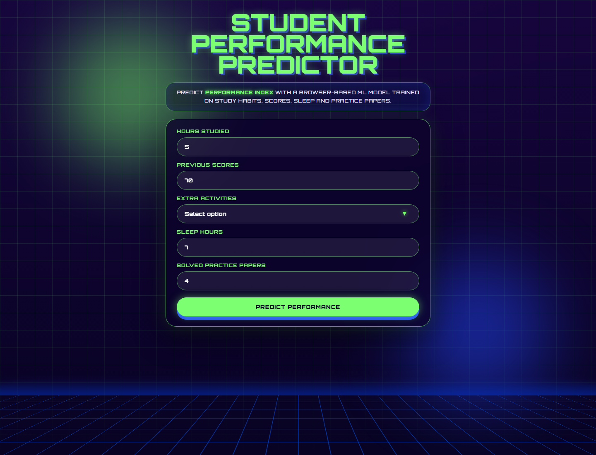
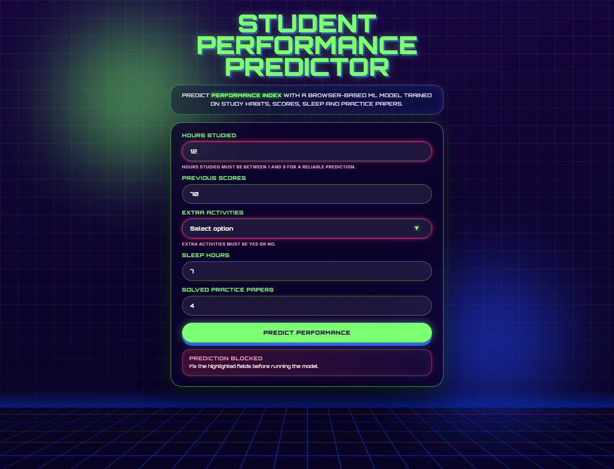
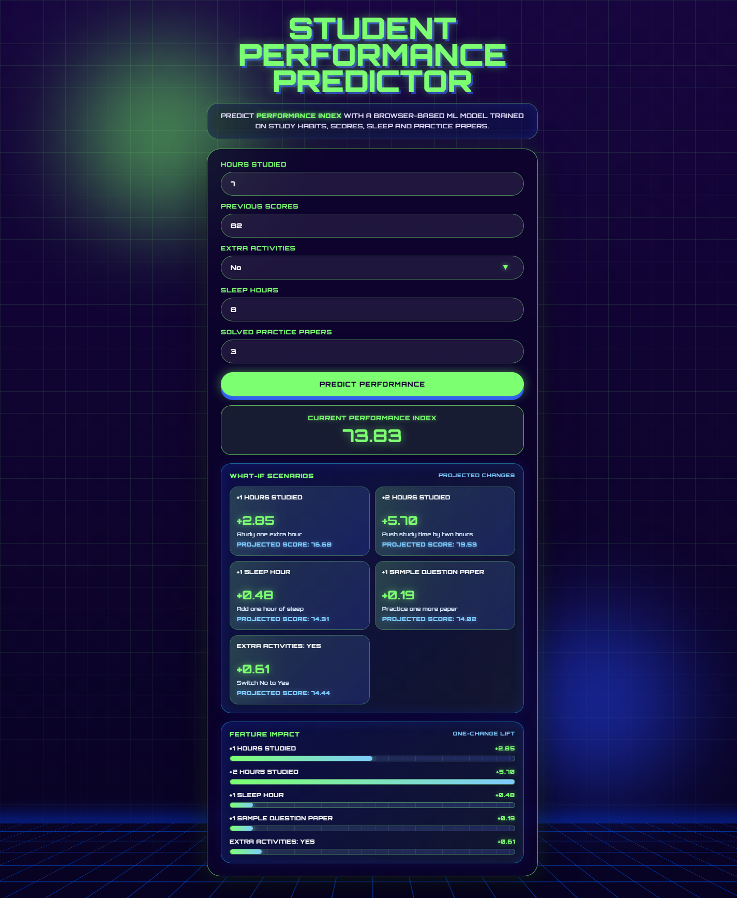

<div align="center">

# Student Performance Predictor

A machine learning web app that predicts a student's `Performance Index` from study habits, previous scores, sleep, extracurricular activities and practice data.


[Live demo](https://kornholio216.github.io/student-performance-predictor/)

</div>

## Overview

Student Performance Predictor is an end-to-end machine learning project that connects a Python training workflow with a browser-based Vue application. The model is trained with `scikit-learn`, exported to JavaScript with `m2cgen`, and used directly in the frontend without a Python backend.

The app predicts `Performance Index` from five input features:

- `Hours Studied`
- `Previous Scores`
- `Extracurricular Activities`
- `Sleep Hours`
- `Sample Question Papers Practiced`

The project focuses on the full deployment path: training a model, exporting it, and using it in a real web interface.

## Preview

### Main Form



### Validation



### Prediction Insights



## Key Features

- Linear regression model trained in Python.
- Data preprocessing and feature encoding in a Jupyter Notebook.
- Regression metrics saved as JSON.
- Model exported from Python to JavaScript with `m2cgen`.
- Browser-side prediction with no backend API.
- Vue 3 + Vite frontend.
- Input validation based on the training data range.
- `What-if` scenarios that show how the prediction changes after small input changes.
- Neon-styled `Feature Impact` panel based on prediction differences.
- Model contract test that protects the feature order and compares the web predictor with the ML export.
- GitHub Pages deployment through GitHub Actions.

## Dataset

The project uses the Kaggle dataset `Student Performance (Multiple Linear Regression)` by Nikhil Narayan. The dataset contains 10,000 synthetic student records and is intended for educational and illustrative use.

The original features are:

| Feature | Description |
| --- | --- |
| `Hours Studied` | Total number of hours spent studying by the student |
| `Previous Scores` | Scores obtained by the student in previous tests |
| `Extracurricular Activities` | Whether the student takes part in extracurricular activities |
| `Sleep Hours` | Average number of sleep hours per day |
| `Sample Question Papers Practiced` | Number of sample question papers practiced |
| `Performance Index` | Target value representing overall academic performance |

Because the dataset is synthetic and has a limited feature range, the frontend blocks predictions outside the training range. This keeps the app from showing extrapolated results as regular predictions.

| Input | Allowed range |
| --- | ---: |
| `Hours Studied` | 1-9 |
| `Previous Scores` | 40-99 |
| `Sleep Hours` | 4-9 |
| `Sample Question Papers Practiced` | 0-9 |
| `Extracurricular Activities` | `Yes` or `No` |

## Machine Learning Workflow

The model is trained in `ml/notebooks/training.ipynb`. During preprocessing, the column `Extracurricular Activities` is renamed to `Extra Activities` and encoded as:

- `Yes` -> `1`
- `No` -> `0`

The model uses the following feature order:

```python
feature_columns = [
    "Hours Studied",
    "Previous Scores",
    "Extra Activities",
    "Sleep Hours",
    "Sample Question Papers Practiced"
]
```

This order is important because the exported JavaScript model receives a numeric array, not named columns.

## Model Metrics

The current `LinearRegression` model achieved the following metrics on the test set:

| Metric | Value |
| --- | ---: |
| MAE | 1.6111 |
| MSE | 4.0826 |
| RMSE | 2.0205 |
| R2 | 0.9890 |

An `R2` score close to 1 means that the linear model fits this dataset very well. The `RMSE` value is close to 2, so the model is usually off by about two `Performance Index` points.

## JavaScript Model Export

The trained model is exported with `m2cgen`:

```python
js_code = m2c.export_to_javascript(model)
js_code += "\n\nexport { score };\n"

export_paths = [
    "../exports/model.js",
    "../../web/src/model/predictor.js"
]

for export_path in export_paths:
    os.makedirs(os.path.dirname(export_path), exist_ok=True)
    with open(export_path, "w") as f:
        f.write(js_code)
```

The notebook writes the exported model to two places:

- `ml/exports/model.js` - model export stored with the ML artifacts.
- `web/src/model/predictor.js` - model used directly by the Vue app.

The generated model is a plain JavaScript function:

```javascript
function score(input) {
  return -33.921946215556126
    + input[0] * 2.852483930072525
    + input[1] * 1.016988198932932
    + input[2] * 0.6086166795764233
    + input[3] * 0.47694148417627186
    + input[4] * 0.19183144145054268;
}

export { score };
```

## Web Application

The frontend is built with Vue 3 and Vite. After the user enters valid data and clicks `Predict Performance`, the app:

1. validates the input values against the training data range,
2. converts `Extra Activities` to `1` or `0`,
3. creates the model input array in the correct feature order,
4. calls `score(input)` in the browser,
5. displays the current prediction,
6. calculates `What-if` scenarios,
7. shows feature impact as prediction differences.

The interface uses a retro-futuristic visual style with a dark background, neon green highlights, blue accents and a grid-like scene. It is styled to make the application clearer and more pleasant to use than a raw ML demo.

## Model Contract Test

The frontend includes a small contract test:

```bash
cd web
npm test
```

The test checks that:

- `score(input)` returns the expected value for a known input,
- the web predictor and the ML export return the same results for selected test inputs.

This protects the most fragile part of the integration: the feature order passed from Vue to the exported model.

## Project Structure

```text
student-performance-predictor/
├── ml/
│   ├── data/
│   │   └── Student_Performance.csv
│   ├── notebooks/
│   │   └── training.ipynb
│   ├── exports/
│   │   ├── metrics.json
│   │   └── model.js
│   └── requirements.txt
│
├── web/
│   ├── public/
│   ├── src/
│   │   ├── model/
│   │   │   ├── predictor.js
│   │   │   └── predictor.contract.test.js
│   │   ├── App.vue
│   │   ├── main.js
│   │   └── style.css
│   ├── index.html
│   ├── package.json
│   └── vite.config.js
│
├── screenshots/
│   ├── app-home.png
│   ├── validation-error.png
│   └── prediction-insights.png
│
├── .github/
│   └── workflows/
│       └── deploy.yml
├── README.md
└── .gitignore
```

## Run Locally

### Web App

```bash
cd web
npm install
npm run dev
```

The app will be available at the local URL printed by Vite, usually:

```text
http://localhost:5173/
```

### Production Build

```bash
cd web
npm run build
```

### Machine Learning Notebook

```bash
cd ml
python -m venv .venv
.\.venv\Scripts\activate
pip install -r requirements.txt
jupyter notebook
```

Open:

```text
notebooks/training.ipynb
```

After running all notebook cells, these files should be created or updated:

```text
ml/exports/metrics.json
ml/exports/model.js
web/src/model/predictor.js
```

## Deployment

The web application is deployed to GitHub Pages with GitHub Actions.

Live demo:

```text
https://kornholio216.github.io/student-performance-predictor/
```

The workflow is stored in:

```text
.github/workflows/deploy.yml
```

On every push to `main`, the workflow installs dependencies, runs the model contract test, builds the Vite app and publishes `web/dist` to GitHub Pages.

## Summary

This project shows the path from a trained regression model to a deployed browser application. The model is trained in Python, exported to JavaScript and used directly in Vue, so predictions run fully on the client side. The app also includes validation, prediction insights and a styled interface instead of stopping at a notebook result.
